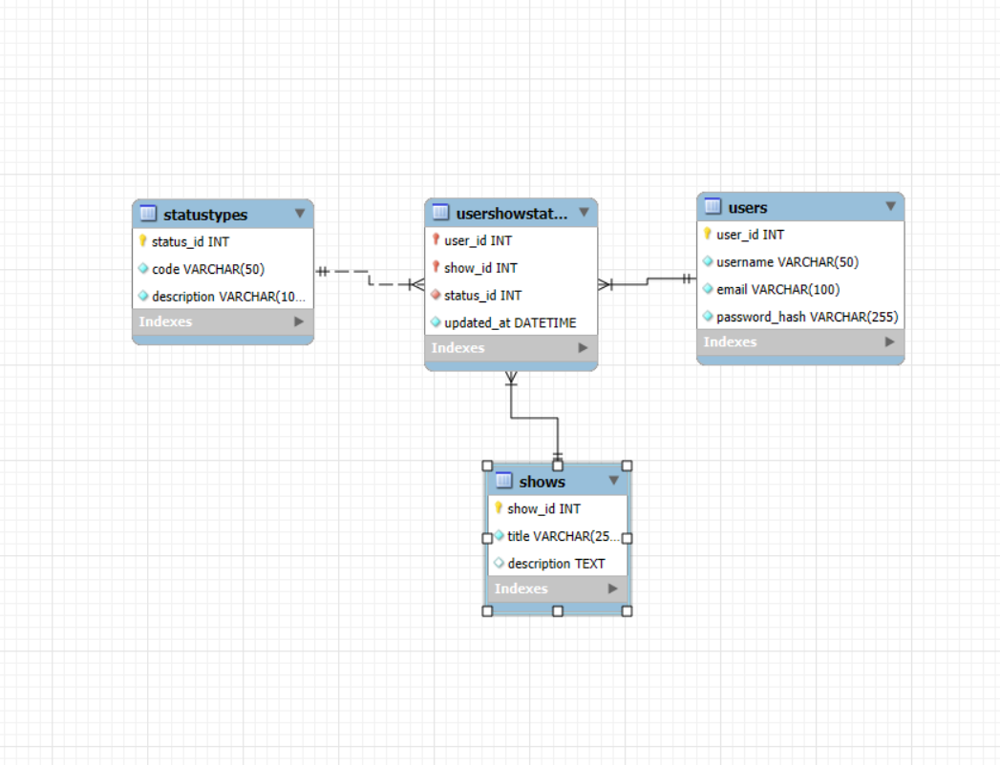

# TV_Progress_Tracker
Simple tv show progress tracker that uses java and a mysql local database.

## Instructions

- Run the ```SQL schema and data script.sql``` script on your local mysql database.
- Open the ```tv_progress_tracker``` folder in your IDE of choice.
- Rename the ```config``` file under the resources folder into ```config.properties``` and assign the correct username and password.
- Run the ```Main.java``` file

Usernames and passwords are in the ```SQL schema and data script.sql``` script.

## ER diagram


